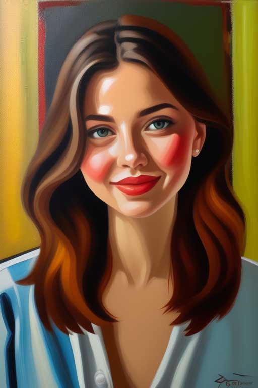
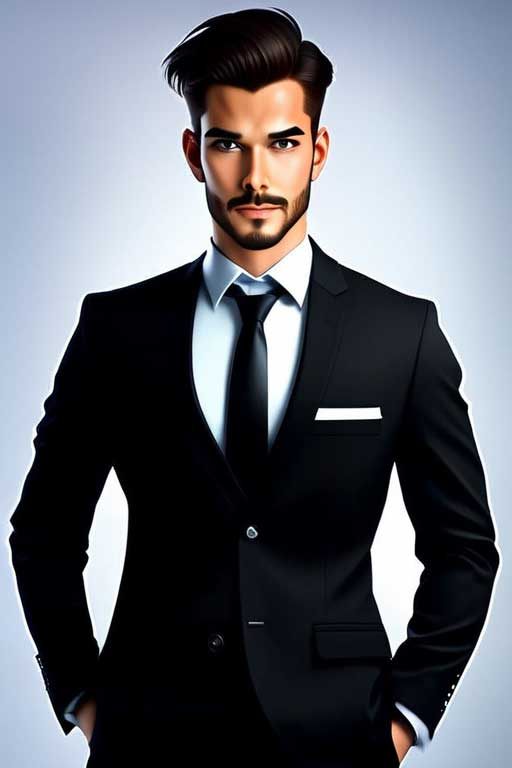
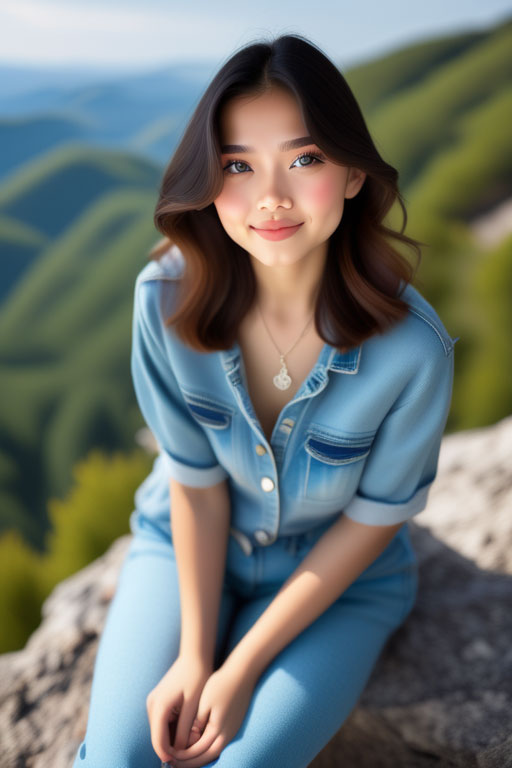
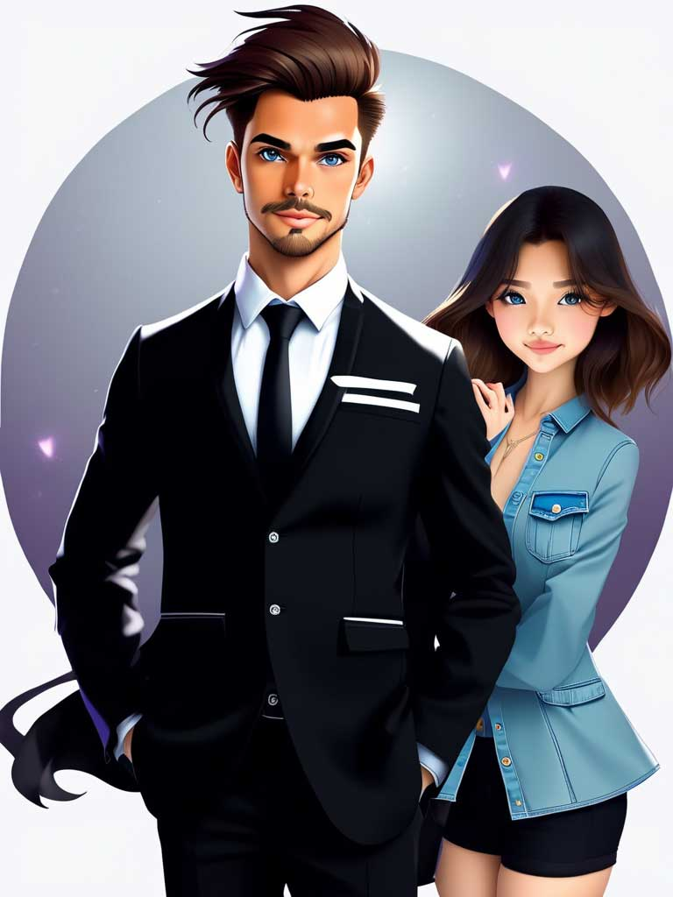
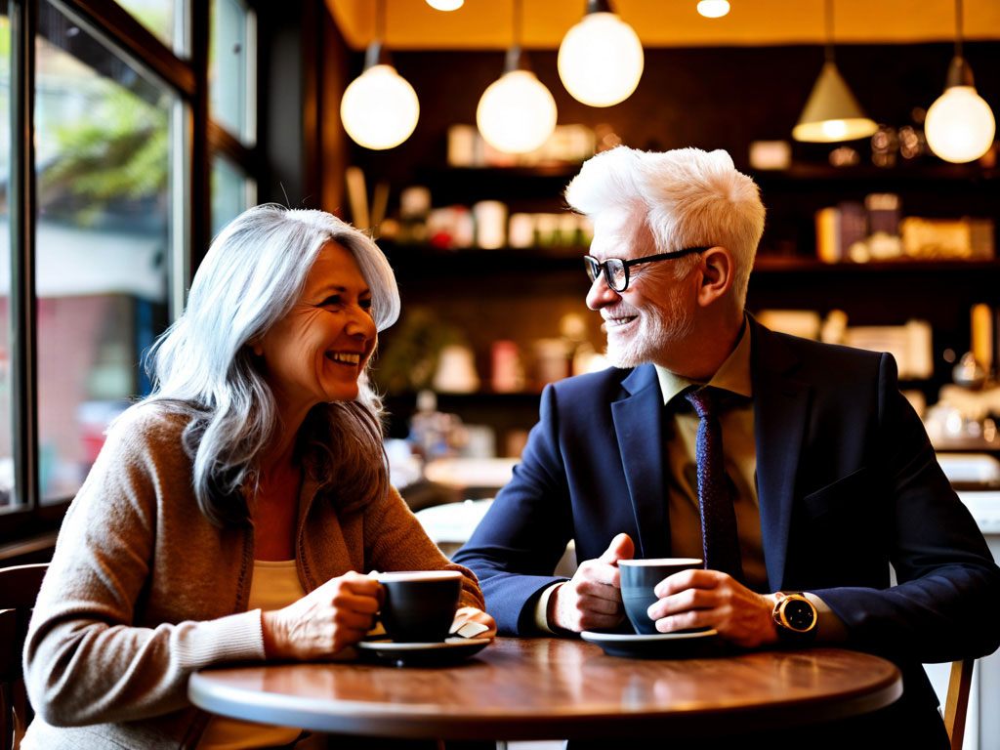
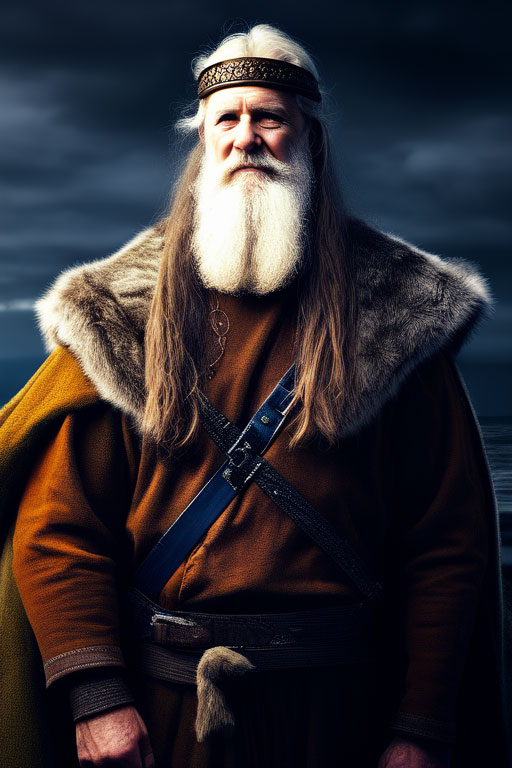
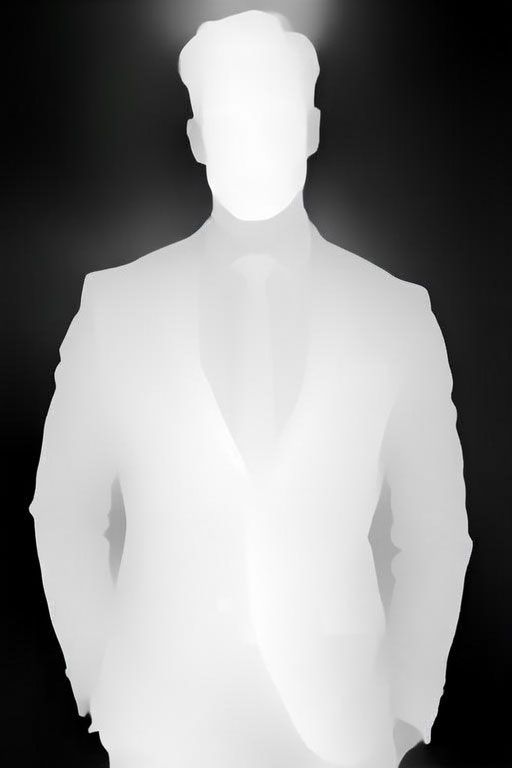
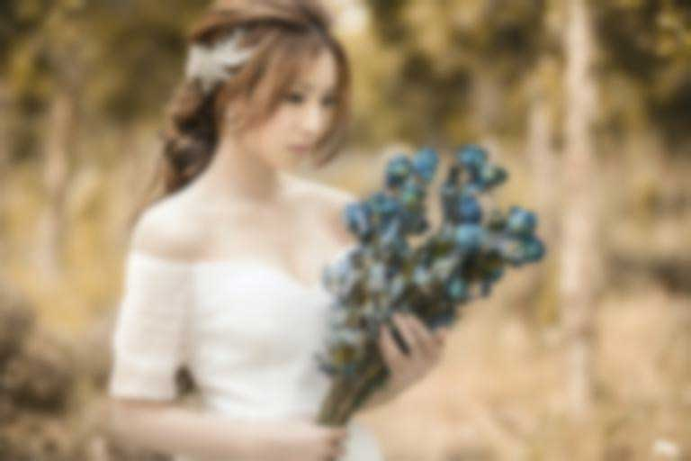
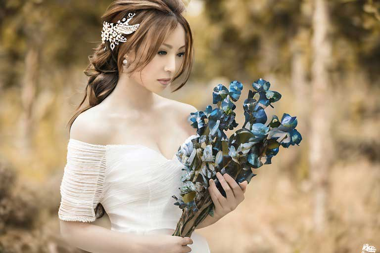

# ComfyUI-OmniGen

A ComfyUI custom node implementation of [OmniGen](https://github.com/VectorSpaceLab/OmniGen), a powerful text-to-image generation and editing model.

<h2>Features</h2>

  
- Text-to-Image Generation
- Image Editing
- Support for Multiple Input Images
- Memory Optimization Options
- Flexible Image Size Control

## Installation
#### 1. ComfyUI-Manager
  1. Search for `ComfyUI-OmniGen` on [ComfyUI Manager](https://github.com/ltdrdata/ComfyUI-Manager) and install it.
  2. Restart ComfyUI
#### 2. Git Clone
  1. Open the terminal on the ComfyUI `ComfyUI/custom_nodes` folder
  2. Run `git clone https://github.com/1038lab/ComfyUI-OmniGen.git`
  3. Restart ComfyUI

## Install the required Python packages:
  1. Open the terminal on the `ComfyUI/custom_nodes/AILab_OmniGen` folder
  2. `..\..\..\python_embeded\python.exe -m pip install -r requirements.txt`

<h3>Auto-Download Feature</h3>

The node includes automatic downloading of:
1. OmniGen code from GitHub repository
2. Model weights from Hugging Face

No manual file downloading is required. The node will handle everything automatically on first use.

>[!IMPORTANT]
>The first time you use this custom node, it will automatically download the model from Hugging Face. Please be patient, as the download size is approximately 15.5 GB, and it may take some time to complete.
>
>Alternatively, you can manually download the model from Hugging Face at the following link:
>Download OmniGen-v1 from [Hugging Face](https://huggingface.co/Shitao/OmniGen-v1/tree/main)
>After downloading, place the model in the following directory: `comfyui/models/LLM/OmniGen-v1`

### Example workflows
Simple usage for text-to-image & image-to-image.

Generate 2 images and combine images.

Following the pose of this image `image_1`, generate a new photo: Aa viking old man standing.

Generate a depth map from the input image and create a new image based on the depth map.

Deblur this image, `image_1`

### Example prompts:
  
| Prompt | Image_1 | Image_2 | Image_3 | Output |
| ------ | ------ | ------ | ------ | ------ |
| 20yo woman looking at viewer |  |  |  |  |
| Transform `image_1` into an oil painting |  |  |  |  |
| Transform `image_2` into an Anime |  |  |  |  |
| The girl in `image_1` sitting on a rock on top of the mountain. |  |  |  |  |
| Combine `image_1` and `image_2` in anime style. |  |  |  |  |
| A woman from `image_1` and a man from `image_2` are sitting across from each other at a cozy coffee shop, each holding a cup of coffee and engaging in conversation. |  |  |  |  |
| Following the depth mapping of this image `image_1`, generate a new photo: an elderly couple sitting at a cozy coffee shop. The scene should feature the couple enjoying a peaceful moment together at a table. The elderly man, with a gray beard and glasses, and the woman, with short silver hair and a soft cardigan, are sipping coffee and smiling at each other. The atmosphere is warm, with soft, ambient lighting and a blurred background of other patrons, shelves of books, and cafe decorations. The depth and textures from `image_1` should be integrated to emphasize the intimate, serene setting. |  |   |  |  |
| Detect the skeleton of a human in this image: `image_1` |  |  |  |  |
| Following the pose of this image `image_1`, generate a new photo: A Viking old man standing |  |  |  |  |
| Detect the depth map of a human in this image: `image_1` |  |  |  |  |
| Deblur this image: `image_1` |  |  |  |  |

<h2>Using Images in Prompts and Settings</h2>

  
You can reference input images in your prompt using either format:
- `<|image_1|></img>`, `<|image_2|></img>`, `<|image_3|></img>`
- `image_1`, `image_2`, `image_3`
- `image1`, `image2`, `image3`

## Usage
The node will automatically download required files on first use:
- OmniGen code from GitHub
- Model weights from Hugging Face (Shitao/OmniGen-v1)
  
### Input Parameters
- `prompt`: Text description of the desired image
- `num_inference_steps`: Number of denoising steps (default: 50)
- `guidance_scale`: Text guidance scale (default: 2.5)
- `img_guidance_scale`: Image guidance scale (default: 1.6)
- `max_input_image_size`: Maximum size for input images (default: 1024)
- `width/height`: Output image dimensions (default: 1024x1024)
- `seed`: Random seed for reproducibility

### Memory Optimization Options
- `separate_cfg_infer`: Separate inference process for different guidance (default: True)
- `offload_model`: Offload model to CPU to reduce memory usage (default: True)
- `use_input_image_size_as_output`: Match output size to input image (default: False) 

<h2>Credits</h2>

- Model Weights: [Shitao/OmniGen-v1](https://huggingface.co/Shitao/OmniGen-v1)

---
